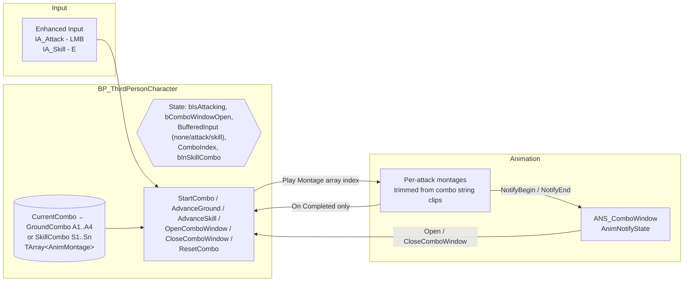

# Technical Document — Hack & Slash Combat Prototype

**Project:** aether_test · **Engine:** Unreal Engine 5.4.4 · **Status:** Combat core v1 (ground combo chain complete; GAS layer in progress)
**Author:** Nguyen Nguyen · August 2026

---

## 1. Overview

A third-person hack-and-slash prototype focused on montage-driven melee combos, built on the ThirdPerson template with the free RamsterZ bare-handed animation set (retargeted UE4 Mannequin → UE5 Manny via IK Retargeter).

Current deliverable: **two chained bare-handed combos** — a 4-hit ground chain (LMB) and a distinct skill chain (E) with its own move set — with mid-chain branching in both directions, flavor-aware input buffering, impact-timed chain windows, root-motion forward drive, and movement lock during attacks. The architecture makes every remaining combat feature (launcher, air combo) a *data extension*, not new logic. Transition polish between the two chains is functional and still being tuned.

## 2. Architecture

**Flow:** each attack key either starts its chain (`StartCombo` with the matching montage array), advances/switches chains if the chain window is open (`AdvanceGround` / `AdvanceSkill`), or is **buffered by key** and auto-consumed the moment the window opens. Each montage carries one `ANS_ComboWindow` notify-state strip that opens/closes the window by calling back into the character. `On Completed` of the final montage resets all state; `On Interrupted` is deliberately unhandled — the next attack interrupting the previous one *is* the chain mechanism.

## 3. Key design decisions

### 3.1 Two combo architectures were built and compared

The animation source is a **combo string** (one clip containing 4 consecutive punches), which allows two implementations:

| | **A — One montage + sections** (built first) | **B — One montage per attack** (shipped) |
|---|---|---|
| Chaining | `Montage_JumpToSection` — instant cut, no blending | `Montage_Play` next asset — natural crossfade (0.1s in / 0.15s out) |
| Asset prep | Sections cut inside the clip, section auto-links cleared | Clip trimmed into per-attack montages via segment Start/End time |
| Logic | Needs section names, link clearing, jump management | Plain montage array + index; no section handling at all |
| Extensibility | Awkward across multiple source clips; branching is hacky | Chain = editable array; branches/launcher/air = other arrays |
| Observed feel | Visible pops on early chains; hard seam between different source clips | Smooth transitions at any input timing |

Approach A works and preserves the animator's authored flow, but play-testing showed hard cuts when chaining early and no way to blend across source clips. Approach B was adopted: **each attack is an independent montage trimmed from the string** (e.g. A2 = 0.43s→0.73s of the source clip), chained by playing the next asset. Montage blending then provides transition smoothing for free, and the combo definition becomes pure data.

### 3.2 Chain windows are anchored to measured impact frames

Instead of eyeballing, impact timings were extracted by **sampling hand-bone extension per frame** (editor Python, `AnimPoseExtensions`): fist-to-pelvis distance peaks at frames 10 / 16 / 28 / 42 → those are the contact frames. Each chain window opens **at contact** and stays open to the end of that attack. Combined with input buffering (early presses fire exactly when the window opens), this guarantees every punch is shown through its contact frame while staying fully responsive to button mashing.

### 3.3 Montage callback lifecycle

With per-attack montages, interruption is the normal chaining path. Rule: **`On Completed` → reset combat state; `On Interrupted` / `On Blend Out` → intentionally ignored.** (Binding reset to `On Interrupted` makes the combo cancel itself on every chain; binding it to `On Blend Out` fires at blend *start* and was measured to cut the effective chain window by 0.15s.)

### 3.4 Genre-standard locomotion rules

- **Root motion from montages**: attacks physically drive the capsule forward (enabled on the combat AnimSequences; ABP already set to *Root Motion from Montages Only*), eliminating the mesh-snap-back artifact of visual-only root translation.
- **Movement lock while attacking**: `MaxWalkSpeed` 0 on combo start, restored on reset — no foot-sliding while attacking, per hack-and-slash convention (movement during attacks comes from root motion only).

### 3.5 Dual-chain input: chain switching + flavor-aware buffering

The two chains (LMB ground, E skill) share one state machine. Pressing the *other* key mid-chain switches `CurrentCombo` and restarts the new chain from its first move (`ComboIndex = -1` before advancing) — evaluated per press inside the chain window. An earlier iteration shared the combo index across chains (sensible while both chains used near-identical animations); once the skill chain received its own move set, that was replaced by the reset-on-switch rule.

The input buffer records **which key** was pressed (`BufferedInput`: none / attack / skill), not just that something was pressed. This is what makes finisher-chaining reliable: spamming E around the last ground hit always enters the skill chain the instant that hit's window opens, instead of dying on an index overflow. Known remaining polish: the visual seam between the ground finisher pose and the skill opener is acceptable but not perfect — being tuned via per-montage blend-in times and segment cut points.

## 4. Tooling note

The editor was driven partly through the Remote Control API (HTTP + Python): batch property edits (blend times, root motion flags), remote Blueprint compilation checks, per-frame PIE state tracing to diagnose the blend-out/window interaction, and the bone-sampling measurement in §3.2. All timing values in this document come from those measurements rather than estimation.

## 5. Roadmap to full test scope

| Requirement | Plan |
|---|---|
| 5+ attack combinations, ground 3+ / air 2+ | **Done:** ground 4-hit chain, skill chain (E), mid-chain branch both directions, finisher-chain from last ground hit. **Remaining:** RMB launcher + aerial montage pair gated by `State.InAir` |
| GAS: HP/Stamina + effects | C++ `UCombatAttributeSet` (Health/Stamina) + ASC on a shared character base; combo moves into a GameplayAbility; stamina cost via Cost GE; poison DoT as periodic GE with GameplayCue visual |
| Dynamic camera | SpringArm lag + combat-aware arm length/FOV interp + hit camera shake (collision test built-in) |
| HUD | UMG bound to attribute-change delegates; combo counter driven by hit events |
| Enemies | Same character base (inherits health/poison for free), simple chase-and-attack AI, wave spawner |

## 6. How to run

1. Unreal Engine 5.4.4, open `aether_test.uproject`, press Play.
2. **LMB** — ground combo chain (4 hits). **E** — skill combo chain; press mid-chain to branch, or around the ground finisher to chain straight into the skill string. Both mash-friendly (per-key input buffering). Movement: WASD + Space (template).
